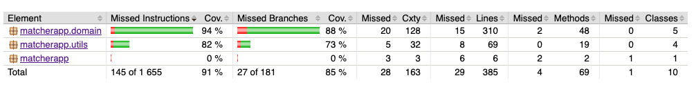
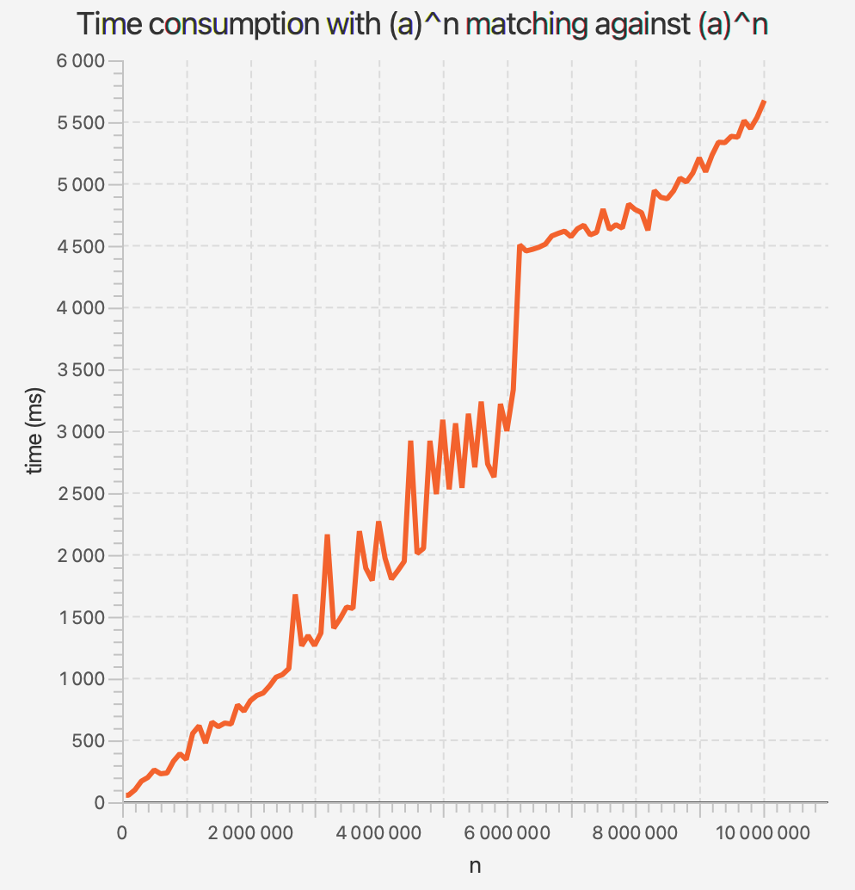

# Testing document

## Unit testing

There is two testing classes for unit testing. 
CompilerTest is checking that different syntaxes will produce correct states. 
MatcherTest is testing matching overall with different syntaxes working also as a integration test.
Tests can be run with command `mvn test`.

Testing coverage is monitored with Jacoco. Instruction coverage is 91 % and branch coverage is 85 %. 
Overall testing coverage is in good shape, but also it can be always better. Below is a screenshot from from Jacoco report taken at 17.4.2021.

## Manual testing

I have done manual testing with user interface while implementing new features, and I have made sure different thing are working as they should. 
There is also user interface for performance testing taking inputs, input sizes etc. and draws line chart from measured times that matching makes.

## Performance testing

There is a class for drawing a line chart for the performance test: PerformanceTest. 
It takes inputs and conducts performance tests, and after testing it draws a line chart. 
There is instructions for using this feature in the user manual.
I conducted two tests: matching a^n to a^n with different values of n, and similarly matching a^n to (a?)^n(a)^n. 
The results are below, and we can see how this engine works suprisingly well even with longer strings.

