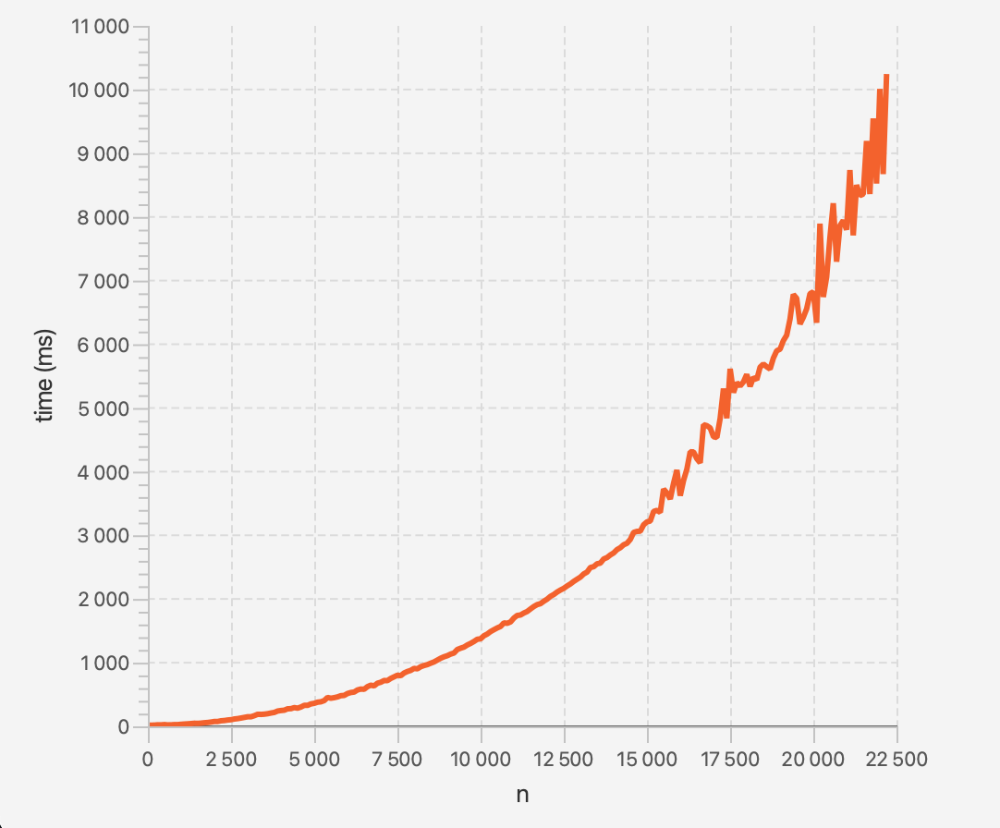

# Testing document

## Unit testing

There is two testing classes for unit testing. 
CompilerTest is checking that different syntaxes will produce correct states. 
MatcherTest is testing matching with different syntaxes.

## Manual testing

I have done manual testing with GUI while implementing new features, and I have made sure different thing are working as they should.
 

## Performance testing

There is a new class in the ui package: PerformanceTest. It basically is used to return a LineChart object to be used in gui.
I conducted two tests: matching a^n to a^n with different values of n, and similarly matching a^n to (a?)^n(a)^n. 
The results are below, and we can see how this engine works suprisingly well even with longer strings.

